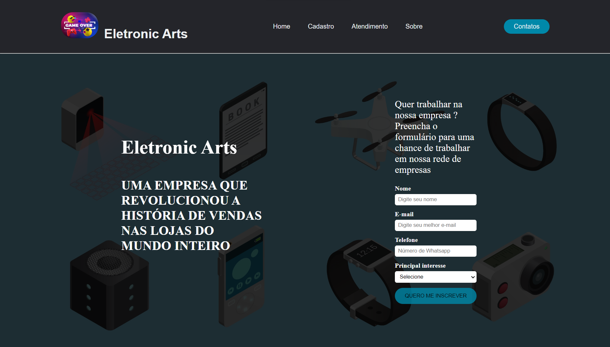

<h1 align="center">
  💻 Eletronic Arts -  Pablo Santos
</h1>

<h4 align="center"><a href="https://pablo-m-santos.github.io/Portfolio/">Clique para visitar o projeto</a></h4>

## 🌳 Projeto
A Eletronic Arts é tipo a loja dos sonhos para quem curte games, com um monte de consoles, PCs, acessórios e jogos de todos os tipos!

## 📃 Seções
a Eletronic Arts é composto por 5 seções diferentes:

  -  Seção Home: ** Nele temos uma breve apresentação e além disso, temos apresentação,localização e alguns produtos;
  -  Seção Cadastro: ** Nessa seção tem o formulário de cadastro onde o cliente coloca os seus dados;
  -  Seção Atendimento: ** Aqui apresenta a forma do cliente saber como ele vai receber o pedido,troca e devolução e serviços;
  -  Seção Sobre: ** Apresenta a empresa falando como começamos no mundo da tecnologia e a nossa história;
  -  Seção Contato: ** Nela temos uma área tanto para o cliente entrar em contato quanto para o cliente tirar as suas dúvidas ;

## 👨🏽‍💻 Tecnologias utilizadas
Para o desenvolvimento do portfólio usei as seguintes tecnologias:
  - Visual Studio Code;
  - HTML ;
  - Css;
  - JavaScript
  - Bootstrap;
